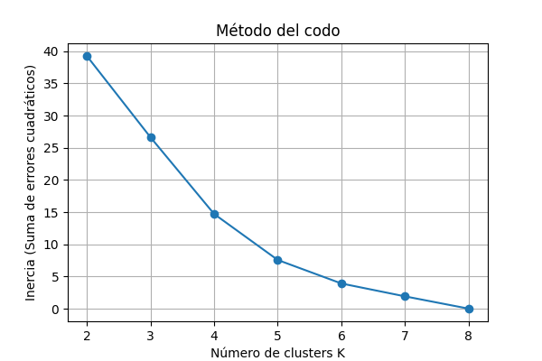
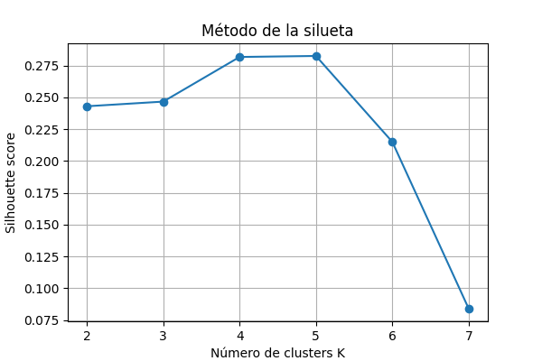
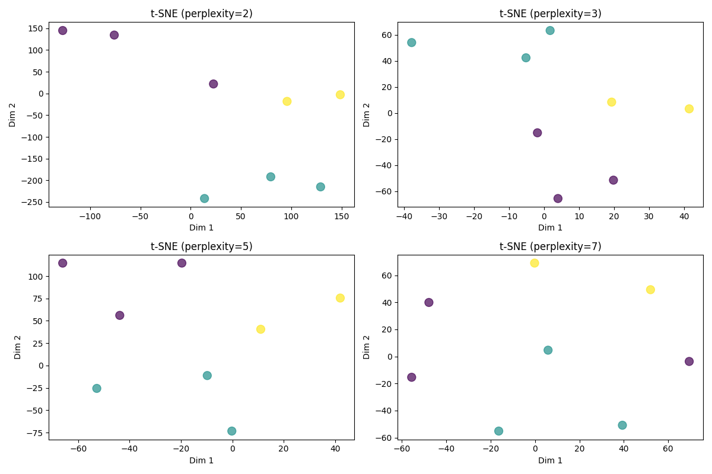

Este proyecto corresponde al **Módulo 7 del Bootcamp de Ciencia de Datos**.  
El objetivo fue **analizar patrones de consumo musical en distintos países** aplicando **técnicas de aprendizaje no supervisado (clustering y reducción de dimensionalidad)**, para agrupar naciones según similitudes culturales y de escucha.

---

## 🌐 Repositorio
- [Ver en GitHub](https://github.com/LirBast/Portafolio/tree/portafolio/modulo_7) 

---

## 🛠️ Tecnologías usadas
- Python (Pandas, NumPy, Scikit-learn, Matplotlib)  
- Algoritmos de clusterización (K-Means, DBSCAN, Jerárquico)  
- Técnicas de reducción de dimensionalidad (PCA, t-SNE)  

---

## 📋 Requerimientos implementados
1. **📊 Carga y Exploración de Datos**  
   - Dataset con popularidad de géneros musicales en distintos países (Chile, EE.UU., México, Corea, Japón, Alemania, Rusia, Italia).  
   - Revisión de distribuciones, tendencias y valores nulos.  

2. **🤖 Clusterización**  
   - **K-Means:** aplicado con K=3, optimización de K con el método del codo y coeficiente de silueta.  
   - **Clustering Jerárquico:** dendrograma y comparación con K-Means (ARI = 1.0).  
   - **DBSCAN:** probado con distintos parámetros `eps` y `min_samples`, resultados poco efectivos en este dataset.  

3. **📉 Reducción de Dimensionalidad**  
   - **PCA:** cálculo de varianza explicada y visualización en 2D.  
   - **t-SNE:** visualización 2D con diferentes valores de `perplexity`.  

4. **📈 Comparación de Resultados**  
   - Discusión de ventajas y limitaciones de cada método de clusterización.  
   - Contraste de representaciones con PCA y t-SNE.  

---

## 📊 Visualizaciones
Algunas de las visualizaciones generadas en este módulo:  

- **Figura 1:** Método del codo para selección de K  

- **Figura 2:** Coeficiente de silueta según K  

- **Figura 3:** Dendrograma de clustering jerárquico  

- **Figura 4:** DBSCAN  

- **Figura 5:** PCA 2D mostrando los clústeres

- **Figura 6:** t-SNE con perplexity alto  

---

## 📝 Reflexiones del Ejercicio

En este análisis se observó que **K-Means y el clustering jerárquico coincidieron en la formación de tres clústeres principales**, con un índice de similitud (ARI = 1.0), lo que confirma la consistencia de los resultados. El método del codo mostró una caída clara en K=3 y K=5, pero el valor de K=3 resultó ser el más interpretable y estuvo respaldado también por el dendrograma. Por otro lado, DBSCAN no funcionó adecuadamente: con valores pequeños de `eps` clasificó la mayoría de países como ruido y con valores grandes agrupó casi todos en un único clúster, perdiendo capacidad de diferenciación. Por lo tanto, los métodos más efectivos en este caso fueron K-Means y el jerárquico, ya que captaron estructuras claras y consistentes en los datos.  

En cuanto a las técnicas de reducción de dimensionalidad, **PCA mostró que con 4 componentes principales se podía explicar más del 90% de la varianza**, lo que lo convierte en una herramienta útil para la reducción de dimensiones de forma interpretativa. Sin embargo, en la visualización 2D algunos países aparecieron solapados, dado que PCA es una técnica lineal que no capta relaciones no lineales. En contraste, **t-SNE permitió separar de manera más clara los grupos** al ajustar el parámetro de `perplexity`, resultando más eficaz para representar patrones complejos, aunque sin ofrecer la misma interpretación estadística que PCA.  

Los clústeres obtenidos reflejaron tanto **similitudes culturales como convergencias globales**. Por ejemplo, Estados Unidos, México y Alemania se agruparon por su fuerte exposición a géneros globales como pop, electrónica y rock. Chile, Corea y Rusia, aunque distantes geográficamente, mostraron afinidades en hip-hop, pop y fusiones locales/globales como reguetón y K-pop. Japón e Italia, en cambio, destacaron por géneros tradicionales y melódicos como la música clásica, el metal y el J-pop, conviviendo con influencias modernas.  

Finalmente, los resultados se relacionan con tendencias globales en el consumo musical. Se observa el dominio de **géneros internacionales** como pop, hip-hop y electrónica, impulsados por plataformas digitales como Spotify, YouTube y TikTok. También destaca la **fusión de géneros locales con globales**, como el reguetón y el K-pop, que han pasado de ser fenómenos regionales a influencias internacionales. A la vez, persisten **tradiciones culturales propias**, como la música clásica en Italia o el J-pop en Japón. En conclusión, los clústeres muestran la homogeneización del consumo musical global, al mismo tiempo que evidencian cómo los mercados locales refuerzan su identidad para destacar en la industria internacional.  

---

✍️ *Autor: Liroy Cataldo*
